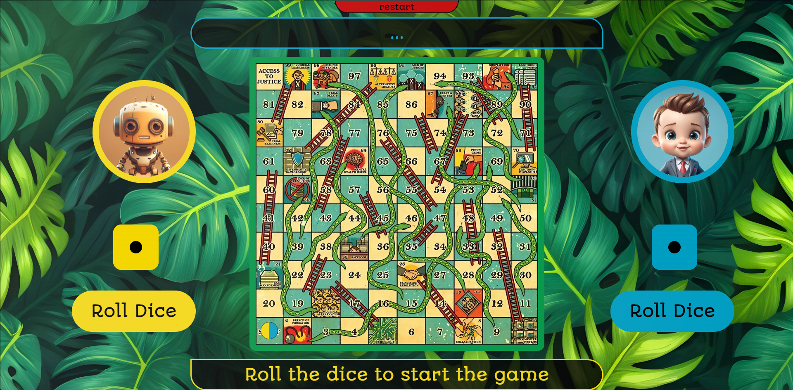
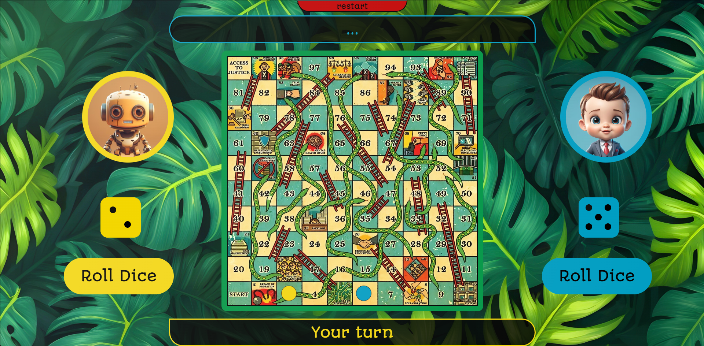

# Snake & Ladders Game

This is a web-based implementation of the classic Snake & Ladders game. The game features a graphical interface with animated dice rolls and player movements.

## Screenshots

## Project Structure

- **Audio/**: Contains audio files used in the game.
- **Image/**: Contains image files used in the game.
- **Index.html**: The main HTML file that sets up the game interface.
- **Script/script.js**: The JavaScript file containing the game logic.
- **Style/style.css**: The CSS file for styling the game interface.

## How to Run

1. Clone the repository to your local machine.
2. Open `Index.html` in a web browser.

## Game Rules

- The game is played between two players: "robot" and "user".
- Players take turns to roll a dice and move their piece forward by the number of steps shown on the dice.
- If a player lands on the bottom of a ladder, they move up to the top of the ladder.
- If a player lands on the head of a snake, they move down to the tail of the snake.
- The first player to reach the 100th cell wins the game.

## Controls

- Use the "Roll Dice" button to roll the dice.
- The game will automatically handle player movements and interactions with snakes and ladders.

## Dependencies

- The game uses Google Fonts for custom fonts.
- Audio files are used for player movements.

